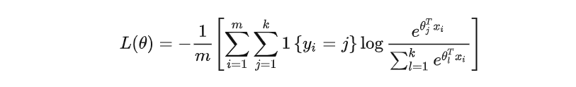
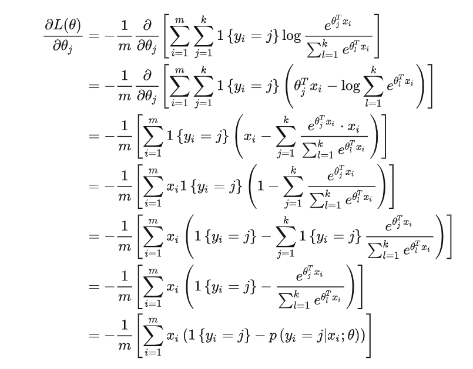
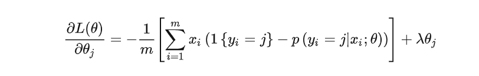
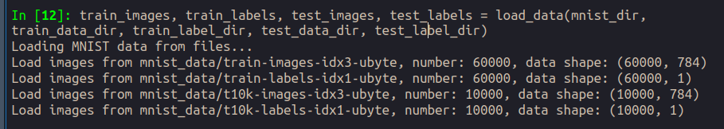
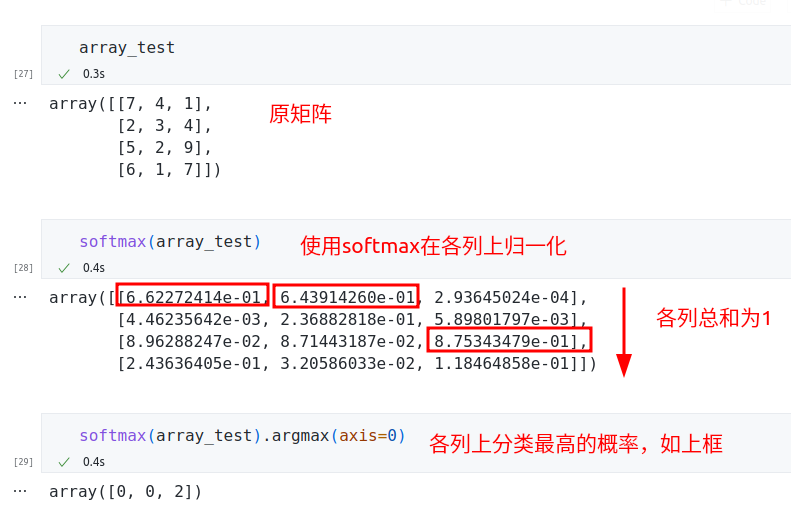

# Exercise1 Softmax Regression

郭坤昌 2012522 计算机科学与技术

## 要求

训练⼀个分类器来完成对MNIST数据集中 0-9 10个手写数字的分类。

1. 在 softmax_regression.py 文件中实现 softmax_regression() 函数，计算每一次迭代的损失值 J (θ, x, y)，将它存储在变量 f 中，并计算梯度 ∇$_θ$ J (θ, x, y)，将它存储在变量g 中。初始代码会将 θ 的形状定义为⼀个 k×n 的矩阵 (K=10个类别)
2. 在 evaluate.py文件中实现cal_accuracy()函数，输出分类器在测试集上的准确率

## 实验原理

用于多分类的`softmax regression`用于估计输入的x${_i}$属于每一类的概率，原理图如下。对于输入特征，使用矩阵$\theta$计算得分，再通过`softmax`函数激活，将得分归一到区间$[0,1]$，即获得分类概率。


使用`softmax`函数激活后，得到$x_i$在每个类别上的分类概率。


特别地，$x_i$被分类为$j$的概率为


`softmax`回归的代价函数为：



其梯度求解为：



为了防止过拟合，引入正则项，此时代价函数和梯度为：




## 实验过程

### 实验环境

python 3.8 with numpy 1.23.4

### 参数设置

```python
mnist_dir = "mnist_data/"	# dir of mnist dataset
train_data_dir = "train-images-idx3-ubyte"
train_label_dir = "train-labels-idx1-ubyte"
test_data_dir = "t10k-images-idx3-ubyte"
test_label_dir = "t10k-labels-idx1-ubyte"
k = 10	# classes
iters = 2000	# iterations to learn
alpha = 0.3	# learning rate
lam=0.005	# coefficient of regulation
```

### 数据集加载

在main函数中调用了加载数据集函数，从`mnist_dir`下读取，因此创建文件夹`mnist_data`，并放入数据文件。在`load_data`中进一步调用了`load_mnist`，而由于开始传入的文件名其实是对应文件夹的名称，为了简便，修改`load_mnist`函数为从该数据集对应文件夹下读取唯一的数据，修改部分代码如下，其余未改变部分用省略号略过。

```python
def load_mnist(file_dir, is_images='True'):
    bin_file_name=os.listdir(file_dir)[0]   # get the only data name from current directory
    bin_file=open(os.path.join(file_dir, bin_file_name), 'rb')
    # bin_file = open(file_dir, 'rb')    # old method to read the directory
    ……
```

读取成功，并能观察到对应数据的格式



### `softmax`函数

`softmax`函数用以计算分类概率。输入应当是规模为$k\times m$的得分矩阵，通过对每一列（$x_i$在每一类上的得分）进行`softmax`归一化得到$x_i$在每一类上的分类概率。

```python
def softmax(z):
    z-=np.max(z)	# in case of overflow
    softmax=(np.exp(z) / np.sum(np.exp(z), axis=0))    # normalize by sum of each column
    return softmax
```

简单验证如下：



### 梯度求解

由之前计算的公式，引入正则项，梯度求解如下。为了观察训练过程，这里也定义了对应的代价函数。`f`和`g`分别对应要求的代价函数和梯度

```python 
def get_gradient(x, y, theta, lam):
    m = x.shape[0]
    score = np.dot(theta, x.T)
    softmax_score = softmax(score)
    f=-np.sum(y*np.log(softmax_score))/m+lam*np.sum(theta*theta)/2
    g = np.dot(softmax_score-y,x)/m+lam*theta
    return f, g
```

### `softmax`回归

迭代，并显示每一次迭代过程中代价函数的变化。$\alpha$对应为学习率。

```python
def softmax_regression(theta, x, y, iters, alpha, lam):
    losses=[]
    for iter in range(iters):
        f, g=get_gradient(x,y,theta,lam)
        theta-=alpha*g
        losses.append(f)
    plt.plot(losses)
    plt.show()
    return theta
```

### 预测和准确率计算

由于$\theta$为$k\times n$矩阵，输入为$m \times n$矩阵，通过矩阵相乘计算测试图片在各类别上的分类概率。

```python
def predict(test_images, theta):
    # scores = np.dot(test_images, theta.T)
    # preds = np.argmax(scores, axis=1)
    scores = np.dot(theta, test_images.T)
    preds = np.argmax(scores, axis=0)
    return preds
```

通过`for`循环直接统计预测正确的数量，并除以总数得到准确率。
```python
def cal_accuracy(y_pred, y):
    acc=0
    for i in range(y.shape[0]):
        if y_pred[i] == y[i]:
            acc += 1
    return acc/y.shape[0]
```

## 实验结果和分析

在迭代次数为2000，学习率为0.3，正则项系数为0.005时进行实验。

损失函数曲线如下。1250轮时已基本不再下降，$\theta$中的每个分类器通过不断训练最终趋近于$\vec{0}$


预测准确率为0.9122


在调整超参数过程中，由如下结论：

1. 学习率不宜过高，也不宜过低。过高使得代价函数下降时震荡明显，不易找到最低点。过低则受正则项影响较大，下降困难。
2. 正则项一定程序防止过拟合，能提高模型分类效果，但其系数不宜过大，否则下降困难。
