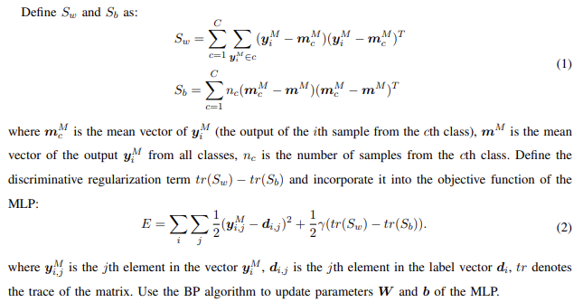

# Exercise2-MLP_BP

郭坤昌 2012522 计算机科学与技术专业

## 要求

以三层感知机为例，使用反向传播算法更新 MLP 的权重和偏置项。

MPL及其权重、偏置项定义如下：

## 模型定义及约定

1. $M$: 层数，约定输入层为第$0$层

2. $N_i$: 第$i$层神经元数量，$N_0$为输入特征个数

3. $f$: 激活函数，在$\mathbb{R} $上连续可导

4. $w_{ij}^{l}$: 连接第$l$层第$i$个神经元与第$l-1$层第$j$个神经元的权值，其中$l=1,2,\dots, M,i=0,1,\dots,N_{i}-1,j=0,1,\dots,N_{i-1}$

5. $w_{i,N_{l-1}}^{l}$: 第$l$层第$i$个神经元的阈值

6. $b_{i}^{l}$: 第$l$层第$i$个神经元的偏置项，其中$l=1,2,\dots,M, i=0,1,\dots N_{l}-1$

7. $net_{i}^{l}$: 第$l$层第$i$个神经元输入值，有
   $$
   net_{i}^{l} = \sum_{k=0}^{N_{l-1}}w_{ik}^{l}y_{k}^{l-1}+b_{i}^{l-1}, l=1,2,\dots,M, i=0,1,\dots N_{l}-1
   $$

8. $y_{i}^{l}$: 第$l$层第$i$个神经元输出值，有
   $$
   y_{i}^{l}=\left\{
   \begin{array}\\
   f(net_{i}^{l}), &l=1,2,\dots,M, i=0,1,\dots N_{l}-1 \\
   x_{i}, &l=0,i=0,1,\dots ,N_{0}-1 \\
   1, &l=0,1, \dots , M-1, i=N_{l}
   \end{array}
   \right.
   $$

9. $E$: 目标函数（详细的分析在后续推导部分给出）
   $$
   E=\sum_{i}^{} \sum_{j}^{} \frac{1}{2}(y_{ij}^{M}-d_{ij})^2 +\frac{1}{2} \gamma (tr(S_w)-tr(S_b)) 
   $$
   其中
   $$
   \left\{
   \begin{aligned}
   S_{w} &= \sum_{c=1}^{C}\sum_{y_{i}^{M}\in c}(y_{i}^{M}-m_{c}^{M})(y_{i}^{M}-m_{c}^{M})^{T} \\
   S_{b} &= \sum_{c=1}^{C}(m_{c}^{M}-m^{M})(m_{c}^{M}-m^{M})^{T} \\
   \end{aligned}
   \right.
   $$

10. $\eta$: 学习率

11. $\Delta w_{ij}^{l}$: 权值变化量
    $$
    \Delta  w_{ij}^{l}=-\eta \frac{\partial E}{\partial w_{ij}^{l}}, l=1,2,\dots, M,i=0,1,\dots,N_{i}-1,j=0,1,\dots,N_{i-1}
    $$

12. $\Delta b_{i}^{l}$: 偏置项变化量
    $$
    \Delta b_{i}^{l}=-\eta \frac{\partial E}{\partial b_{i}^{l}}, l=1,2,\dots, M,i=0,1,\dots,N_{i}-1
    $$

## 推导

### 改写目标函数

1. 改写$S_{w}$和$S_{b}$

目标函数中增加了一个正则化项，它是由最终分类器输出结果的散度矩阵（类内散度矩阵$S_w$和类间散度矩阵$S_b$）求迹组成的。猜测这里的神经网络运用了Fisher线性判别的思想，达到在分类问题上提取特征的目的。

> 该部分使用另一种形式的散度矩阵，详细证明过程参照[ Fisher线性判别散度矩阵Sb,Sw 另一种表达形式的证明](https://blog.csdn.net/lqzdreamer/article/details/79690296)

$$
S_{w} = \sum_{c=1}^{C}\sum_{y_{i}^{M}\in c}(y_{i}^{M}-m_{c}^{M})(y_{i}^{M}-m_{c}^{M})^{T}
$$
其中$m_c^M$是所有判别为$c$类的$y_i^M$的均值向量，以$n_{c}$表示判别为$c$类的$y_i^M$的均值向量个数，则
$$
m_{c}^{M}=\frac{1}{n_{c}} \sum_{y_{i}^{M} \in c} y_{i}^{M}
$$
$S_w$可以改写为
$$
S_{w} = \frac{1}{2}\sum_{i,j} A_{i,j}^{w} (y_i^M-y_j^M) (y_i^M-y_j^M)^T
$$

其中
$$
A_{i,j}^{w}=\left\{
\begin{array}\
\frac{1}{n_c},&y_i^M \in c,y_j^M \in c \\
0, &y_i^M \in c_1,y_j^M \in c_2,c_1 \ne c_2
\end{array}
\right.
$$
对于类间散度
$$
S_{b} = \sum_{c=1}^{C}(m_{c}^{M}-m^{M})(m_{c}^{M}-m^{M})^{T}
$$
其中$m^M$是$y_i^M$在所有类上判别的均值向量，以这里所有最终分类器数目等于$N_M$，则
$$
m^{M}=\frac{1}{N_M} \sum_{i=0}^{N_M-1} y_{i}^{M}
$$
$S_b$可以改写为
$$
S_{w} = \frac{1}{2}\sum_{i,j} A_{i,j}^{b} (y_i^M-y_j^M) (y_i^M-y_j^M)^T
$$
其中
$$
A_{i,j}^{b}=\left\{
\begin{array}\
\frac{1}{N_M}-\frac{1}{n_c},&y_i^M \in c,y_j^M \in c \\
\frac{1}{N_M}, &y_i^M \in c_1,y_j^M \in c_2,c_1 \ne c_2
\end{array}
\right.
$$

这样
$$
\begin{aligned}
tr(S_w)-tr(S_b)
&=tr(S_w-S_b) \\
&=tr(\frac{1}{2}\sum_{i,j} A_{i,j}^{w} (y_i^M-y_j^M) (y_i^M-y_j^M)^T-\frac{1}{2}\sum_{i,j} A_{i,j}^{b} (y_i^M-y_j^M) (y_i^M-y_j^M)^T)\\
&=\frac{1}{2}  \sum_{i,j}(A_{i,j}^{w}-A_{i,j}^{b}) tr((y_i^M-y_j^M) (y_i^M-y_j^M)^T))
\end{aligned}
$$

2. 改写目标函数$E$

在目标函数中 $\sum_{i}^{} \sum_{j}^{} \frac{1}{2}(y_{ij}^{M}-d_{ij})^2$可改写为$\sum_{k=0}^{N_{M}-1} \frac{1}{2}(y_{k}^{M}-d_{k})^2$，则最终目标函数改写为如下公式
$$
\begin{align*}
E=\sum_{k=0}^{N_{M}-1} \frac{1}{2}(y_{k}^{M}-d_{k})^2 +\frac{1}{2} \gamma (tr(S_w)-tr(S_b))
\end{align*}
$$

3. 根据目标函数计算$\frac{\partial E}{\partial y_{k}^{M}}$ 

$$
\begin{align*}
\frac{\partial E}{\partial y_{k}^{M}}
&=y_{k}^{M}-d_{k} + \frac{1}{2} \gamma (\frac{1}{2}\sum_{j=0}^{N_{M}-1}4(A_{k,j}^{w}-A_{k,j}^{b})(y_k^M-y_j^M))\\
&=y_{k}^{M}-d_{k} + \gamma (\sum_{j=0}^{N_{M}-1}(A_{k,j}^{w}-A_{k,j}^{b})(y_k^M-y_j^M))
\end{align*}
$$

显然，散度矩阵求迹再求导的结果，与最终计算结果的分类有关。特别地，对$y_{k}^{M}$求偏导时，该项计算结果与其他结果的分类有关。

### 计算权值和偏置项变化量

1. 链式法则变换
$$
\begin{align*}
\Delta  w_{ij}^{l}&=-\eta \frac{\partial E}{\partial w_{ij}^{l}} \\
&=-\eta \frac{\partial E}{\partial net_{i}^{l}} \frac {\partial net_{i}^{l}}{\partial w_{ij}^{l}} \\
\Delta b_{i}^{l}&=-\eta \frac{\partial E}{\partial b_{i}^{l}} \\
&=-\eta \frac{\partial E}{\partial net_{i}^{l}} \frac {\partial net_{i}^{l}}{\partial b_{i}^{l}}
\end{align*}
$$
   令

$$
\delta _{i}^{l} = - \frac{\partial E}{\partial net_{i}^{l}}
$$
   根据
$$
net_{i}^{l} = \sum_{k=0}^{N_{l-1}}w_{ik}^{l}y_{k}^{l-1}+b_{i}
$$
   计算得
$$
\begin{align*}
\frac{\partial net_{i}^{l}}{\partial w_{ij}^{l}}&=y_{j}^{l-1} \\
\frac{\partial net_{i}^{l}}{\partial b_{i}}&=1
\end{align*}
$$
   则
$$
\begin{align*}
\Delta  w_{ij}^{l}&=\eta \delta _{i}^{l} y_{j}^{l-1}\\
\Delta b_{i}^{l}&=\eta \delta _{i}^{l} \\
\end{align*}
$$

2. 求取$\delta _{i}^{l}$

当$l=M$时，此时为输出层
$$
\begin{align*}
\delta _{i}^{l} 
&= \delta _{i}^{M} \\
&= - \frac{\partial E}{\partial net_{i}^{M}} \\
&= - \frac{\partial E}{\partial y_{i}^{M}}\frac{\partial y_{i}^{M}}{\partial net_{i}^{M}}
\end{align*}
$$
由
$$
y_{i}^{l} = f(net_{i}^{l})
$$
得
$$
\frac{\partial y_{i}^{l}}{\partial net_{i}^{l}} = f^{'}
$$
又根据之前计算得到$\frac{\partial E}{\partial y_{k}^{M}}$，
$$
\begin{align*}
\frac{\partial E}{\partial y_{k}^{M}}
&=y_{k}^{M}-d_{k} + \gamma (\sum_{j=0}^{N_{M}-1}(A_{k,j}^{w}-A_{k,j}^{b})(y_k^M-y_j^M))
\end{align*}
$$
因此可以计算出$\delta _{i}^{M}$（为了简洁直到最终结果，均不将$\frac{\partial E}{\partial y_{k}^{M}}$展开）
$$
\begin{align*}
\delta _{i}^{M} 
&= - \frac{\partial E}{\partial y_{i}^{M}}\frac{\partial y_{i}^{M}}{\partial net_{i}^{M}} \\
&= - \frac{\partial E}{\partial y_{i}^{M}} f^{'}

\end{align*}
$$

当$l<M$时，此时为隐含层
$$
\begin{align*}
\delta _{i}^{l} 
&= - \frac{\partial E}{\partial net_{i}^{l}} \\
&= - \sum_{k=0}^{N_{l+1}-1} \frac{\partial E}{\partial net_{k}^{l+1}} \frac{\partial net_{k}^{l+1}}{\partial net_{i}^{l}} \\
&= - \sum_{k=0}^{N_{l+1}-1} \delta _{k}^{l+1} \frac{\partial net_{k}^{l+1}}{\partial y_{i}^{l}} \frac{\partial y_{i}^{l}}{\partial net_{i}^{l}}
\end{align*}
$$
由
$$
net_{k}^{l+1} = \sum_{i=0}^{N_{l}}w_{kj}^{l+1}y_{i}^{l}+b_{k}^{l+1}
$$
得
$$
\frac{\partial net_{k}^{l+1}}{\partial y_{i}^{l}}=w_{ki}^{l+1}
$$
又
$$
\begin{align*}
\
\frac{\partial y_{i}^{l}}{\partial net_{i}^{l}} &= f^{'}
\end{align*}
$$
因此
$$
\begin{align*}
\delta _{i}^{l} 
&= - \sum_{k=0}^{N_{l+1}-1} \delta _{k}^{l+1} \frac{\partial net_{k}^{l+1}}{\partial y_{i}^{l}} \frac{\partial y_{i}^{l}}{\partial net_{i}^{l}} \\
&= -f^{'} \sum_{k=0}^{N_{l+1}-1} \delta _{k}^{l+1} w_{ki}^{l+1}
\end{align*}
$$
综上
$$
\delta _{i}^{l}=\left\{
\begin{array}\\
-\frac{\partial E}{\partial y_{i}^{M}} f^{'}, &l=M \\
-f^{'} \sum_{k=0}^{N_{l+1}-1} \delta _{k}^{l+1} w_{ki}^{l+1},&l<M
\end{array}
\right.
$$

3. 权值和偏置量更新

本题为3层感知机，即$M=3$则

(这里为了与幂区分，将表示层数的上标括起)
$$
\left\{
\begin{aligned}
\delta _{i}^{(3)} 
&= -f^{'} \frac{\partial E}{\partial y_{i}^{M}} \\

\\

\delta _{i}^{(2)} 
&= -f^{'} \sum_{k=0}^{N_{3}-1} \delta _{k}^{(3)} w_{ki}^{(3)} \\
&= -f^{'} \sum_{k=0}^{N_{3}-1} (-\frac{\partial E}{\partial y_{k}^{M}} f^{'}) w_{ki}^{(3)} \\
&= (-f^{'})^{2} \sum_{k=0}^{N_{3}-1} \frac{\partial E}{\partial y_{k}^{M}} w_{ki}^{(3)} \\
\\

\delta _{i}^{(1)} 
&= -f^{'} \sum_{k=0}^{N_{2}-1} \delta _{k}^{(2)} w_{ki}^{(2)} \\
&= -f^{'} \sum_{k=0}^{N_{2}-1} ((f^{'})^{2} \sum_{t=0}^{N_{3}-1} \frac{\partial E}{\partial y_{t}^{M}} w_{ti}^{(3)}) w_{ki}^{(2)} \\
&= (-f^{'})^{3} \sum_{k=0}^{N_{2}-1} (\sum_{t=0}^{N_{3}-1} \frac{\partial E}{\partial y_{t}^{M}} w_{ti}^{(3)}) w_{ki}^{(2)} \\

\end{aligned}
\right.
$$
由之前计算得
$$
\begin{align*}
\Delta  w_{ij}^{l}&=\eta \delta _{i}^{l} y_{j}^{l-1}\\
\Delta b_{i}^{l}&=\eta \delta _{i}^{l} \\
\end{align*}
$$
更新权值
$$
\left\{
\begin{aligned}\\

\Delta  w_{ij}^{(3)}
&=\eta \delta _{i}^{(3)} y_{j}^{(2)}\\
&=\eta  (-f^{'}) y_{j}^{(2)} \frac{\partial E}{\partial y_{i}^{M}}, i=0,1,\dots, N_{3}-1,j=0,1,\dots, N_{2} \\

\\

\Delta  w_{ij}^{(2)}
&=\eta \delta _{i}^{(2)} y_{j}^{(1)}\\
&=\eta y_{j}^{(1)} (-f^{'})^{2} \sum_{k=0}^{N_{3}-1} \frac{\partial E}{\partial y_{k}^{M}} w_{ki}^{(3)}, i=0,1,\dots, N_{2}-1,j=0,1,\dots, N_{1} \\

\\

\Delta  w_{ij}^{(1)}
&=\eta \delta _{i}^{(1)} y_{j}^{(0)}\\
&=\eta x_{j}(-f^{'})^{3} \sum_{k=0}^{N_{2}-1} (\sum_{t=0}^{N_{3}-1} \frac{\partial E}{\partial y_{t}^{M}} w_{ti}^{(3)}) w_{ki}^{(2)} , i=0,1,\dots, N_{1}-1,j=0,1,\dots, N_{0}\\

\\

\Delta b_{i}^{(3)}
&= \eta \delta _{i}^{(3)} \\
&= \eta (-f^{'}) \frac{\partial E}{\partial y_{i}^{M}} , i=0,1,\dots, N_{3}-1 \\

\\

\Delta b_{i}^{(2)}
&= \eta \delta _{i}^{(2)} \\
&= \eta (-f^{'})^{2} \sum_{k=0}^{N_{3}-1} \frac{\partial E}{\partial y_{k}^{M}} w_{ki}^{(3)} , i=0,1,\dots, N_{2}-1 \\

\\

\Delta b_{i}^{(1)}
&= \eta \delta _{i}^{(1)} \\
&= \eta (-f^{'})^{3} \sum_{k=0}^{N_{2}-1} (\sum_{t=0}^{N_{3}-1} \frac{\partial E}{\partial y_{t}^{M}} w_{ti}^{(3)}) w_{ki}^{(2)}, i=0,1,\dots, N_{1}-1

\end{aligned}
\right.
$$

其中
$$
\frac{\partial E}{\partial y_{k}^{M}}
=y_{k}^{M}-d_{k} + \gamma (\sum_{j=0}^{N_{M}-1}(A_{k,j}^{w}-A_{k,j}^{b})(y_k^M-y_j^M))
$$
且有
$$
A_{i,j}^{w}=\left\{
\begin{array}\
\frac{1}{n_c},&y_i^M \in c,y_j^M \in c \\
0, &y_i^M \in c_1,y_j^M \in c_2,c_1 \ne c_2
\end{array}
\right.
\\

A_{i,j}^{b}=\left\{
\begin{array}\
\frac{1}{N_{M}}-\frac{1}{n_c},&y_i^M \in c,y_j^M \in c \\
\frac{1}{N_{M}}, &y_i^M \in c_1,y_j^M \in c_2,c_1 \ne c_2
\end{array}

\right.
$$

其中$n_{c}$表示判别为$c$类的$y_i^M$的均值向量个数

## 参考文献

[ Fisher线性判别散度矩阵Sb,Sw 另一种表达形式的证明](https://blog.csdn.net/lqzdreamer/article/details/79690296)