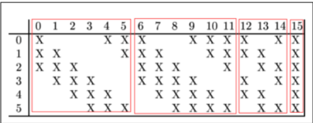
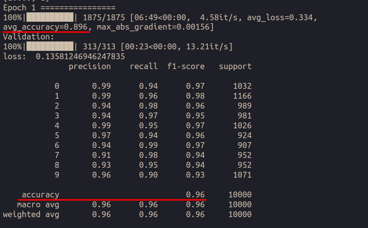
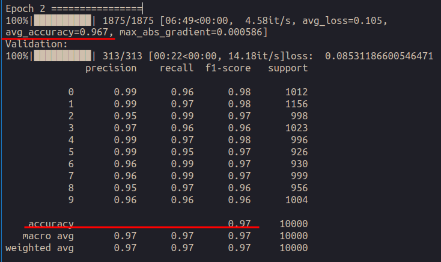

# LeNet5实验报告

计算机科学与技术 2012522 郭坤昌

## 摘要

本实验主要通过以numpy实现LeNet5，并完成基于MNIST数据集的手写数字识别。首先介绍实现LeNet5的基本网络结构和参数，接着介绍具体网络的实现——网络模型和各层的前向传播、反向传播实现，最后介绍训练过程及结果。完整代码详见：[Lenet5](https://gitee.com/guo-kunchang/machine-learning/tree/master/LeNet5)

## 关键词

LeNet5；卷积；池化；BP算法；

## 网络结构与参数

详细网络参数如下表：

| 层号 | 名称      | 输入<br />(高度,宽度,通道)/特征图数 | 卷积核/池化核<br />(高度,宽度,数量) | (步长,补白) | 输出<br />(高度,宽度,通道)/特征图数 |
| ---- | --------- | ----------------------------------- | ----------------------------------- | ----------- | ----------------------------------- |
| 1    | 输入层    | None                                | None                                | None        | (28,28,1)                           |
| 2    | 卷积层1   | (28,28,1)                           | (5,5,6)                             | (1,2)       | (28,28,6)                           |
| 3    | 池化层1   | (28,28,6)                           | (2,2,1)                             | (2,0)       | (14,14,6)                           |
| 4    | 卷积层2   | (14,14,6)                           | (5,5,16)                            | (1,0)       | (10,10,16)                          |
| 5    | 池化层2   | (10,10,16)                          | (2,2,1)                             | (2,0)       | (5,5,16)                            |
| 6    | 全连接层1 | (5,5,16)                            | (5,5,120)                           | (1,0)       | 120                                 |
| 7    | 全连接层2 | 120                                 | None                                | None        | 84                                  |
| 8    | 输出层    | 84                                  | None                                | None        | 10                                  |

> - 输入输出中，为突出网络结构，在表示时略去了输入图片的数量这一特征
>- 这里没有明确指明卷积层和全连接层激活函数的选择，本实验使用ReLU函数进行激活
> - 在本实验中，由于输入图片像素为$28 \times 28$，因此设置卷积层1的`Padding=2`，则输出图片大小$(28+2 \times 2-5)/1+1=28$，保证了输出规模与原模型中输出规模一致

图示如下：


## 代码实现细节

首先给出Lenet5网络的整体结构代码，接下来介绍各层设计，最后介绍训练过程和结果分析代码

### LeNet5

网络结构大致遵循第三部分介绍的LeNet5的基本结构，并设置各层相应参数。在这里，卷积层和全连接层的激活函数选用ReLU函数

1. 第一层为卷积层。卷积核大小`5*5 `，步长为1，补白大小为2，输入通道为1，输出通道为6。这里将补白大小设置为2，即可将单张`28*28`大小的图片在卷积过后，仍能以下一层需要的`28*28`的大小提供。
2. 第二层为池化层。池化核大小为`2*2`，步长为2。这样单张大小为`28*28`的图片在池化过后大小为`14*14`。本实验使用最大池化，以保存更多纹理信息
3. 第三层为卷积层。卷积核大小为`5*5`，步长为1，补白为0，输入通道数6，输出通道数16。在原论文中，Yann LeCun特别设计了盖层的卷积方式，不是每个卷积核都对所有通道进行卷积，如下图所示，仅有最后一个卷积核将6个通道进行了卷积。在本次实验中，将采用每个卷积核都对所有通道进行卷积的方式，以增强特征提取能力



4. 第四层为池化层。与第二层池化层参数设置相同
5. 第五层为全连接层。上一层池化后，得到16通道，`5*5`大小的图片，因此首先展平。在经过全连接计算后，输出个数为120
6. 第六层为全连接层。输入个数120，输出个数为84
7. 第七层为输出层。出入个数为120，使用Softmax函数进行激活，最终得到在10个分类上的“概率”

网络模型的大致代码及参数设置如下：

```python
model = Model([
    Conv(out_nchannel = 6, filter_size = 5, stride = 1, padding = 2),
    ReLU(),
    MaxPool(filter_size = 2, stride = 2),
    Conv(out_nchannel = 16, filter_size = 5, stride = 1, padding = 0),
    ReLU(),
    MaxPool(filter_size = 2, stride = 2),
    Flatten(),
    Dense(out_nchannel = 120),
    ReLU(),
    Dense(out_nchannel = 84),
    ReLU(),
    Dense(out_nchannel = 10),
    SoftmaxCrossEntropy()
], learn_rate=0.02)
```

`Model`类具体实现如下：

1. 初始化。由各层进行舒适化，并设置各层学习率

```python
def __init__(self, layers, learn_rate = 0.001):
        for layer in layers:
            layer.learn_rate = learn_rate
        self.layers = layers
        self.learn_rate = learn_rate
```

2. 前向传播。若提供标签，逐层前向传播，返回最终计算分类概率；若提供标签，则额外返回损失函数的值

```python
def forward(self, x, y = None):
        '''
        x is of shape (batch_size, height, width, in_nchannel)
        y is of shape (batch_size, 10)
        if y is None, return probs of shape (batch_size, 10)
        if y is not None, return probs of shape (batch_size, 10) and loss
        '''
        n_samples = x.shape[0]
        for layer in self.layers[:-1]:
            x = layer.forward(x)
        if y is None:
            probs = softmax(x)
            return probs
        assert len(y) == n_samples
        probs, loss = self.layers[-1].forward(x, y)
        return probs, loss
```

3. 训练。根据设定的轮次和每批大小，逐批前向传播，反向传播更新各层权重，期间统计准确率、损失函数值以及最大梯度。最终计算完毕后，使用`sklearn.metrics`打印由预测结果与真实结果之间的效果（在各分类上的准确率，总体准确率、召回率、f1-score等）

```python
def fit(self, x_train, y_train, x_validate, y_validate, epochs=1, batch_size=32):
    '''
    1. train the model by epochs and batches
    2. print validate result of each epoch

    '''
    n_sample = len(x_train)
    n_batch = (n_sample - 1) // batch_size + 1
    for epoch in range(epochs):
        print(f"Epoch {epoch+1} ================")
        with tqdm(total=n_batch) as t:
            total_loss = total_acc = 0
            for i in range(n_batch):
                batch = range(batch_size * i, min(batch_size * (i + 1), n_sample))
                probs, loss = self.forward(x_train[batch], y_train[batch])
                acc = (1 / len(batch)) * np.sum(reverse_one_hot(probs) == reverse_one_hot(y_train[batch]))
                grad = self.backward()
                total_loss += loss
                total_acc += acc
                if (i + 1) % 32 == 0 or i + 1 == n_batch:
                    t.set_postfix({
                        'avg_loss': total_loss / (i + 1),
                        'avg_accuracy': total_acc / (i + 1),
                        'max_abs_gradient': np.max(abs(grad))
                    })
                    cur_n_batch = i % 32 + 1
                    t.update(cur_n_batch)
        print("Validation:")
        validate_probs, validate_loss = self.evaluate(x_validate, y_validate)
        print('loss: ', validate_loss)
        print(metrics.classification_report(reverse_one_hot(validate_probs), reverse_one_hot(y_validate)))
```

4. 预测和评估函数即分类根据是否提供验证标签，返回前向传播的预测概率（预测概率及损失）

```c++
def predict(self, x, batch_size=32):
    '''
    return probabilities
    '''
    probs = []
    n_sample = len(x)
    n_batch = (n_sample - 1) // batch_size + 1
    for i in tqdm(range(n_batch)):
        batch = range(batch_size * i, min(batch_size * (i + 1), n_sample))
        probs.append(self.forward(x[batch]))
    return np.concatenate(probs)

def evaluate(self, x, y, batch_size=32):
    '''
    return probabilities and average loss of each batch
    '''
    probs = []
    n_sample = len(x)
    n_batch = (n_sample - 1) // batch_size + 1
    total_loss = 0
    for i in tqdm(range(n_batch)):
        batch = range(batch_size * i, min(batch_size * (i + 1), n_sample))
        temp_probs, loss = self.forward(x[batch], y[batch])
        probs.append(temp_probs)
        total_loss += loss
    return np.concatenate(probs), total_loss / n_batch
```

### 卷积层

网络中各层的实现从基类`Layer`派生，必须保存各层原始输入（为反向传播准备），并实现前向传播与反向传播

```python
class Layer:
    def forward(self, x):
        self.x = x.copy()
    def backward(self, grad_in):
        raise NotImplementedError
```

卷积层需要提供的参数为输出通道数、卷积核大小、步长、补白大小。

1. 初始化。设定给定参数及用以计算的权重`W`和`b`

```python
def __init__(self, out_nchannel, filter_size, stride = 1, padding = 0):
    self.out_nchannel = out_nchannel
    self.filter_size = filter_size
    self.stride = stride
    self.padding = padding
    self.W = None
    self.b = None
```

2. 前向传播。若权重未初始化，则将权重进行随机初始化。根据二维卷积计算公式进行计算。当使用没有快速优化过的卷积运算，使用`generate_regions`获取卷积计算的行号、列号以及选定区域，再使用卷积核和权重进行计算。`generate_regions`函数具体实现如下，根据步长和卷积核大小生成包含计算信息的序列

```python
def generate_regions(X, dim, stride):
    '''
    Generate regions of size dim x dim from X with stride.
    X is of shape (batch_size, height, width, in_nchannel)
    '''
    assert X.shape[1] >= dim
    assert X.shape[2] >= dim
    for fh, h in enumerate(range(0, X.shape[1] - dim + 1, stride)):
        for fw, w in enumerate(range(0, X.shape[2] - dim + 1, stride)):
            yield fh, fw, np.s_[:, h:h + dim, w:w + dim, :]
```

​		前向传播的具体计算如下：

```python
def forward(self, x):
    '''
    x is of shape (batch_size, height, width, in_nchannel)
    '''
    super().forward(x)
    out_nchannel, filter_size, stride, padding = self.out_nchannel, self.filter_size, self.stride, self.padding
    if self.W is None:
        self.W = np.random.randn(filter_size, filter_size, x.shape[-1], out_nchannel) * np.sqrt(2 / (x.shape[1] * x.shape[2] * x.shape[3]))
        self.b = np.zeros(out_nchannel)
    W, b = self.W, self.b
    x = np.pad(x, [(0, 0), (padding, padding), (padding, padding), (0, 0)], 'constant')
    Wx = np.zeros((len(x), (x.shape[1] - W.shape[0]) // stride + 1, (x.shape[2] - W.shape[1]) // stride + 1, out_nchannel))
    for fh, fw, slice in generate_regions(x, filter_size, stride):
        Wx[:, fh, fw, :] = np.tensordot(x[slice], W, axes=3)
    return Wx + b
```

3. 反向传播。根据下层传播的梯度进行反向传播，最终更新权重

```python
def backward(self, grad_in):
    x = self.x
    dx = np.zeros_like(x, dtype=float)
    dW = np.zeros_like(self.W)
    db = np.zeros_like(self.b)
    filter_size, stride, padding = self.filter_size, self.stride, self.padding
    x = np.pad(x, ((0, 0), (padding, padding), (padding, padding), (0, 0)), 'constant')
    dx_pad = np.zeros_like(x, dtype=float)

    for fh, fw, slice in generate_regions(x, filter_size, stride):
        grad_in_slice = grad_in[:, fh, fw, newaxis, newaxis, newaxis, :]
        dx_pad[slice] += np.sum(self.W * grad_in_slice, axis=-1)
        dW += np.sum(x[slice][..., newaxis] * grad_in_slice, axis=0)
        db += np.sum(grad_in_slice, axis=0).squeeze()
    dx = dx_pad[:, padding:-padding, padding:-padding, :] if padding > 0 else dx_pad
    self.W -= dW * self.learn_rate
    self.b -= db * self.learn_rate
    return dx
```

### 池化层

池化层与卷积层比较相似，前向传播和反向传播实现如下：

```python
def forward(self, x):
    '''
    x is of shape (batch_size, height, width, in_nchannel)
    '''
    super().forward(x)
    filter_size, stride = self.filter_size, self.stride
    out = np.zeros((len(x), (x.shape[1] - filter_size) // stride + 1,
                    (x.shape[2] - filter_size) // stride + 1, x.shape[3]))
    for fh, fw, slice in generate_regions(x, filter_size, stride):
        out[:, fh, fw, :] = np.max(x[slice], axis=(1, 2))
    return out

def backward(self, grad_in):
    x = self.x
    filter_size, stride = self.filter_size, self.stride
    dx = np.zeros_like(x, dtype=float)
    for fh, fw, slice in generate_regions(x, filter_size, stride):
        xs = x[slice]
        indices = np.indices((xs.shape[0], xs.shape[-1]))
        max_indices = (indices[0], ) + np.unravel_index(
            xs.reshape((xs.shape[0], -1, xs.shape[-1])).argmax(axis=1),
            xs.shape[1:-1]) + (indices[1], )
        mask = np.zeros_like(xs)
        mask[max_indices] = 1
        dx[slice] += mask * grad_in[:, fh, newaxis, fw, newaxis, :]
    return dx
```

### 展平

展平仅进行简单的形状变换。将多维数组展平为1维（这里为了突出展平的作用，所述“维度”没有包括表示图片数量的第一维）

```python
class Flatten(Layer):
    def forward(self, x):
        '''
        x is of shape (batch_size, height, width, in_nchannel)
        out is of shape (batch_size, -1)
        '''
        super().forward(x)
        return x.reshape((len(x), -1))
    def backward(self, grad_in):
        return grad_in.reshape(self.x.shape)
```

### 全连接层

全连接层将各输入进行线性加权，最终按输出维度进行输出

```python
class Dense(Layer):
    def __init__(self, out_nchannel):
        self.out_nchannel = out_nchannel
        self.W = None
        self.b = None
        
    def forward(self, x):
        '''
        x is of shape (batch_size, in_nchannel)
        out is of shape (batch_size, out_nchannel)
        '''
        super().forward(x)
        in_nchannel = x.shape[-1]
        out_nchannel = self.out_nchannel
        if self.W is None:
            self.W = np.random.randn(in_nchannel, out_nchannel) * np.sqrt(
                2 / in_nchannel)
            self.b = np.zeros(out_nchannel)
        W, b = self.W, self.b
        return np.dot(x, W) + b
    
    def backward(self, grad_in):
        x = self.x
        dx = np.dot(grad_in, self.W.T)
        self.W -= np.dot(x.T, grad_in) * self.learn_rate
        self.b -= np.sum(grad_in, axis=0) * self.learn_rate
        return dx
```

### 激活函数

ReLU函数的前向传播与反向传播实现如下：

```python
class ReLU(Layer):
    def __init__(self):
        self.mask = None

    def forward(self, x):
        super().forward(x)
        self.mask = x <= 0
        out = x.copy()
        out[self.mask] = 0
        return out

    def backward(self, grad_in):
        dx = grad_in.copy()
        dx[self.mask] = 0
        return dx
```


### Softmax函数

本实验使用softmax函数对最终全连接层的84个输出进行10“分类”（因为Softmax将输出值映射到0~1区间，因此可以作为“分类”使用）。前向传播与反向传播实现如下：

```python
class SoftmaxCrossEntropy(Layer):
    def __init__ (self):
        self.grad = None

    def forward(self, x, y):
        '''
        x is of shape (batch_size, in_nchannel)
        y is of shape (batch_size, in_nchannel)
        return probs of shape (batch_size, in_nchannel) and loss
        '''
        super().forward(x)
        m = x.shape[0]
        probs = softmax(x)
        loss = (-1 / m) * np.log(probs[y==1]).sum()
        self.grad = (probs - y) / m
        return probs, loss

    def backward(self, grad_in):
        return self.grad
```

## 实验环境

实验所需第三方模块及版本如下：

| Packet       | Version |
| ------------ | ------- |
| Python       | 3.8.13  |
| numpy        | 1.23.4  |
| scikit-learn | 1.1.3   |
| matplotlib   | 3.6.2   |
| tqdm         | 4.64.1  |

## 实验结果与分析

设置训练轮数为2，批大小为32。训练过程中准确率和损失函数值，以及最终验证结果如下：

第一轮：



第二轮：



注意到在第一轮的准确率随着批次增加逐渐上升，最终在验证集上的总体准确率达到了96%。而进一步进行第二轮训练时，准确率提升已经不大，最终在验证集上的总体准确率达到97%。

## 总结

通过本次实验，对卷积神经网络的特点和实现有了深刻体会，对最终实验结果的评估和优化有了直观了解。机器学习应用广泛，前景广阔，学习之路才刚开始。


## 参考资料

1. [LeNet-by-numpy](https://github.com/IQ250/LeNet-by-Numpy/blob/master/LeNet_Numpy_Jupyter.ipynb)

2. Y. Lecun, L. Bottou, Y. Bengio and P. Haffner, "Gradient-based learning applied to document recognition," in Proceedings of the IEEE, vol. 86, no. 11, pp. 2278-2324, Nov. 1998, doi: 10.1109/5.726791.
